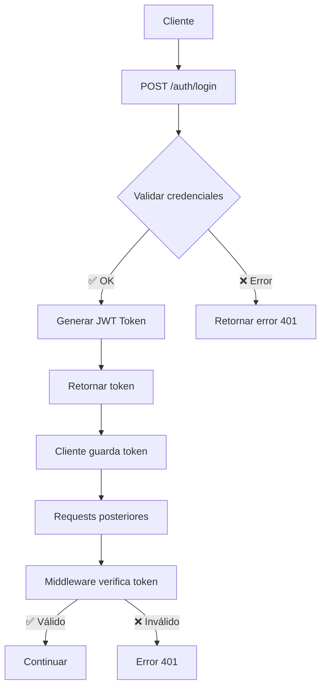
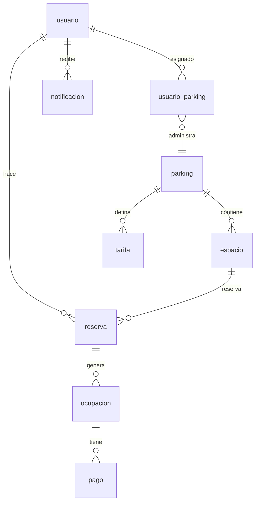

# 🔧 Parking Management System - Backend API

<div align="center">


[](https://opensource.org/licenses/ISC)
[](http://makeapullrequest.com)
[](https://github.com/dariverap/parking-system-api/stargazers)

*🚀 API RESTful robusta para la gestión completa de estacionamientos*

[📖 Documentación](#-documentación-de-la-api) • [🚀 Instalación](#-instalación) • [🔗 Endpoints](#-endpoints) • [🤝 Contribuir](#-cómo-contribuir)

</div>

---

## 📋 Descripción del Proyecto

**Parking Management System - Backend API** es el corazón del sistema de gestión de estacionamientos desarrollado para el curso de **Curso Integrador II: Sistemas** de la **UTP**. Desarrollada con Node.js, Express y Supabase, ofrece una API RESTful completa para la administración de parkings, usuarios, reservas, pagos y notificaciones.

Esta API forma parte del sistema completo **Parking Management System**:
- 🔧 **Backend API** (este proyecto) - API RESTful
- 🖥️ **Frontend Web** - Panel de administración web
- 📱 **Mobile App** - App móvil para usuarios finales

### 🎯 ¿Qué puedes hacer con Parking Management System API?

- 👥 **Gestión de Usuarios**: Registro, autenticación y perfiles
- 🅿️ **Administración de Parkings**: CRUD completo de estacionamientos
- 📅 **Sistema de Reservas**: Creación y gestión de reservas
- 🚗 **Control de Ocupaciones**: Check-in/out de vehículos
- 💳 **Procesamiento de Pagos**: Integración con métodos de pago
- 🔔 **Notificaciones**: Sistema de alertas y mensajes
- 🔐 **Control de Accesos**: Autenticación JWT con roles granulares

---

## 🎓 Información del Proyecto

**🏫 Universidad**: Universidad Tecnológica del Perú (UTP)  
**� Carrera**: Ingeniería de Sistemas  
**� Curso**: Curso Integrador II: Sistemas  
**👨‍🏫 Profesora**: CLAUDIA YOLANDA VILLALTA FLORES  
**📅 Año**: 2025  
**👥 Equipo**: Estudiantes de Ingeniería de Sistemas  

Este proyecto es parte del portafolio académico desarrollado durante el curso de **Curso Integrador II: Sistemas**, demostrando la aplicación práctica de conceptos aprendidos en desarrollo backend, APIs RESTful, bases de datos relacionales y arquitectura de software.

---

## ✨ Características Principales

<div align="center">

| 🚀 **Performance** | 🔒 **Seguridad** | 📊 **Base de Datos** | 🔧 **DevOps** |
|:---:|:---:|:---:|:---:|
| Express.js Framework | JWT Authentication | Supabase/PostgreSQL | Docker Ready |
| Rate Limiting | Role-based Access | Real-time Updates | PM2 Process Manager |
| Request Validation | Input Sanitization | Database Migrations | Environment Config |

</div>

### 🔧 Tech Stack

- **Runtime**: Node.js (v14+)
- **Framework**: Express.js
- **Database**: Supabase (PostgreSQL)
- **Authentication**: JWT (JSON Web Tokens)
- **Validation**: Joi/Custom Validators
- **Documentation**: JSDoc + OpenAPI (futuro)
- **Testing**: Jest + Supertest
- **Process Manager**: PM2
- **Container**: Docker

---

## 🚀 Instalación y Configuración

### 📋 Prerrequisitos

- Node.js >= 14.0.0
- NPM o Yarn
- Cuenta en [Supabase](https://supabase.com)
- PostgreSQL (opcional, si usas local)

### ⚡ Instalación Rápida

```bash
# 1. Clonar el repositorio
git clone https://github.com/dariverap/api-nodejs-parking.git
cd api-nodejs-parking

# 2. Instalar dependencias
npm install

# 3. Configurar variables de entorno
cp .env.example .env

# 4. Editar .env con tus valores
PORT=3001
SUPABASE_URL=tu_url_de_supabase
SUPABASE_KEY=tu_clave_de_supabase
JWT_SECRET=tu_secreto_jwt

# 5. Ejecutar en desarrollo
npm run dev
```

### 🔧 Variables de Entorno

Crea un archivo `.env` en la raíz del proyecto:

```env
# Puerto del servidor
PORT=3000

# Base de datos Supabase
SUPABASE_URL=https://tu-proyecto.supabase.co
SUPABASE_KEY=tu_clave_anonima

# JWT Configuration
JWT_SECRET=tu_secreto_muy_seguro_aqui
JWT_EXPIRES_IN=24h

# Entorno
NODE_ENV=development

# Opcional: Configuración adicional
RATE_LIMIT_WINDOW=15
RATE_LIMIT_MAX_REQUESTS=100
```

### 📱 Scripts Disponibles

```json
{
  "dev": "nodemon src/index.js",
  "start": "node src/index.js",
  "prod": "pm2 start ecosystem.config.js",
  "test": "jest",
  "lint": "eslint src/**/*.js",
  "migrate": "node scripts/migrate.js"
}
```

---

## 🏗️ Arquitectura de la API

### 📁 Estructura del Proyecto

```
api-nodejs-parking/
├── src/
│   ├── controllers/       # Lógica de negocio
│   │   ├── auth.controller.js
│   │   ├── parking.controller.js
│   │   └── ...
│   ├── middleware/        # Middlewares personalizados
│   │   ├── auth.middleware.js
│   │   └── validation.middleware.js
│   ├── models/           # Modelos de datos
│   │   ├── parking.model.js
│   │   └── user.model.js
│   ├── routes/           # Definición de rutas
│   │   ├── auth.routes.js
│   │   └── parking.routes.js
│   ├── utils/            # Utilidades
│   │   ├── jwt.js
│   │   └── validators.js
│   └── index.js          # Punto de entrada
├── scripts/              # Scripts de migración/setup
├── tests/               # Tests unitarios e integración
├── bd.sql              # Esquema de base de datos
├── ecosystem.config.js # Configuración PM2
└── package.json
```

### 🔐 Sistema de Autenticación



---

## 🔗 Endpoints de la API

### 🔐 Autenticación

| Método | Endpoint | Descripción |
|:---:|:---:|:---:|
| `POST` | `/api/auth/register` | Registrar nuevo usuario |
| `POST` | `/api/auth/login` | Iniciar sesión |
| `GET` | `/api/auth/profile` | Obtener perfil actual |
| `PUT` | `/api/auth/update-password` | Actualizar contraseña |

### 👥 Usuarios

| Método | Endpoint | Descripción |
|:---:|:---:|:---:|
| `GET` | `/api/usuarios` | Listar todos los usuarios |
| `GET` | `/api/usuarios/:id` | Obtener usuario por ID |
| `GET` | `/api/usuarios/rol/:rol` | Filtrar por rol |
| `PUT` | `/api/usuarios/:id` | Actualizar usuario |
| `DELETE` | `/api/usuarios/:id` | Eliminar usuario |

### 🅿️ Parkings

| Método | Endpoint | Descripción |
|:---:|:---:|:---:|
| `GET` | `/api/parkings` | Listar parkings |
| `GET` | `/api/parkings/:id` | Detalles de parking |
| `GET` | `/api/parkings/nearby` | Parkings cercanos |
| `POST` | `/api/parkings` | Crear parking |
| `PUT` | `/api/parkings/:id` | Actualizar parking |
| `DELETE` | `/api/parkings/:id` | Eliminar parking |

### 📅 Reservas

| Método | Endpoint | Descripción |
|:---:|:---:|:---:|
| `GET` | `/api/reservas` | Listar reservas |
| `POST` | `/api/reservas/verificar-disponibilidad` | Verificar disponibilidad |
| `POST` | `/api/reservas` | Crear reserva |
| `PUT` | `/api/reservas/:id` | Actualizar reserva |
| `PATCH` | `/api/reservas/:id/estado` | Cambiar estado |
| `DELETE` | `/api/reservas/:id` | Cancelar reserva |

### 🚗 Ocupaciones

| Método | Endpoint | Descripción |
|:---:|:---:|:---:|
| `GET` | `/api/ocupaciones/activas` | Ocupaciones activas |
| `POST` | `/api/ocupaciones` | Registrar entrada |
| `PATCH` | `/api/ocupaciones/:id/salida` | Registrar salida |
| `DELETE` | `/api/ocupaciones/:id` | Eliminar ocupación |

### 💳 Pagos y Métodos de Pago

| Método | Endpoint | Descripción |
|:---:|:---:|:---:|
| `GET` | `/api/pagos` | Listar pagos |
| `POST` | `/api/pagos` | Crear pago |
| `GET` | `/api/metodos-pago` | Listar métodos |
| `POST` | `/api/metodos-pago` | Agregar método |

### 🔔 Notificaciones

| Método | Endpoint | Descripción |
|:---:|:---:|:---:|
| `GET` | `/api/notificaciones` | Listar notificaciones |
| `POST` | `/api/notificaciones` | Crear notificación |
| `PATCH` | `/api/notificaciones/:id/leer` | Marcar como leída |

---

## 🔐 Control de Acceso por Roles

### 👑 Roles del Sistema

| Rol | Descripción | Permisos |
|:---:|:---:|:---:|
| `admin_general` | Super administrador | ✅ Acceso completo |
| `admin_parking` | Admin de parking específico | ✅ Gestión de parking asignado |
| `empleado` | Empleado operativo | ⚠️ Operaciones limitadas |
| `cliente` | Usuario final | 📱 Solo app móvil |

### 🛡️ Middlewares de Seguridad

- **`verifyToken`**: Valida JWT y adjunta `req.user`
- **`hasRole([roles])`**: Restringe por rol global
- **`isParkingAdmin('id')`**: Verifica propiedad del parking

---

## 📊 Esquema de Base de Datos

### 🗂️ Tablas Principales

```sql
-- Usuarios y autenticación
usuario (id_usuario, email, password_hash, nombre, apellido, rol)
usuario_parking (id_usuario, id_parking, rol_en_parking)

-- Parkings y espacios
parking (id_parking, nombre, direccion, latitud, longitud, id_admin)
espacio (id_espacio, id_parking, numero_espacio, estado)

-- Reservas y ocupaciones
reserva (id_reserva, id_usuario, id_espacio, hora_inicio, hora_fin, estado)
ocupacion (id_ocupacion, id_reserva, hora_entrada, hora_salida)

-- Pagos y tarifas
pago (id_pago, id_ocupacion, monto, metodo_pago, estado)
tarifa (id_tarifa, id_parking, tipo_vehiculo, precio_por_hora)

-- Notificaciones
notificacion (id_notificacion, id_usuario, titulo, mensaje, leida)
```

### 🔗 Relaciones Clave



---

## 🧪 Testing y Calidad

### 🏃‍♂️ Ejecutar Tests

```bash
# Tests unitarios
npm test

# Tests con coverage
npm run test:coverage

# Tests de integración
npm run test:integration
```

### 📈 Cobertura de Tests

[](https://coveralls.io)

### 🔍 Linting

```bash
# Verificar código
npm run lint

# Auto-fix
npm run lint:fix
```

---

## 🤝 Cómo Contribuir

¡Las contribuciones son bienvenidas! 🎉

### 📝 Proceso de Contribución

1. **Fork** el proyecto
2. **Crea** una rama (`git checkout -b feature/AmazingFeature`)
3. **Desarrolla** tu feature con tests
4. **Commit** (`git commit -m 'Add AmazingFeature'`)
5. **Push** (`git push origin feature/AmazingFeature`)
6. **Pull Request** con descripción detallada

### 🐛 Reportar Bugs

1. Ve a [Issues](https://github.com/dariverap/api-nodejs-parking/issues)
2. Usa el template "Bug Report"
3. Incluye: pasos para reproducir, entorno, logs

### 💡 Sugerir Features

1. Ve a [Issues](https://github.com/dariverap/api-nodejs-parking/issues)
2. Usa el template "Feature Request"
3. Describe el problema y solución propuesta

### 📋 Estándares de Código

- ✅ ESLint configuration
- ✅ Prettier formatting
- ✅ JSDoc comments
- ✅ Tests obligatorios
- ✅ Conventional commits

---

## 👥 Colaboradores

<div align="center">

| [<br><sub><b>Diego Rivera</b></sub>](https://github.com/dariverap)<br><sub>🚀 Arquitecto & Desarrollador Backend</sub> | [<br><sub><b>Estudiante UTP</b></sub>](https://github.com/utp-student)<br><sub>🤝 Colaborador Frontend</sub> |
|:---:|:---:|

**Proyecto desarrollado como parte del curso Curso Integrador II: Sistemas - UTP**

</div>

---

## 📄 Licencia

Este proyecto está bajo la Licencia ISC - ver el archivo [LICENSE](LICENSE) para más detalles.

[](https://opensource.org/licenses/ISC)

---

## 🙋‍♂️ FAQ

### ❓ ¿Cómo configuro Supabase?
1. Crea cuenta en [supabase.com](https://supabase.com)
2. Crea un nuevo proyecto
3. Copia URL y API Key al `.env`
4. Ejecuta el script de migración 

### ❓ ¿Puedo usar PostgreSQL local?
Sí, modifica las variables de entorno para apuntar a tu instancia local.

### ❓ ¿Cómo hago deploy a producción?
Usa PM2 con `npm run prod` o Docker para contenedorización.

### ❓ ¿Hay rate limiting?
Sí, configurable en variables de entorno (` RATE_LIMIT_WINDOW`, `RATE_LIMIT_MAX_REQUESTS`).

---

## 🚀 Roadmap

- [ ] 📖 Documentación OpenAPI/Swagger
- [ ] 🔄 WebSockets para actualizaciones en tiempo real
- [ ] 💳 Integración con Stripe/PayPal
- [ ] 📊 Analytics y métricas avanzadas
- [ ] 🔒 OAuth 2.0 / Social Login
- [ ] 📧 Sistema de emails
- [ ] 📱 Push Notifications
- [ ] 🌍 Internacionalización
- [ ] 📈 Caching con Redis
- [ ] 🔍 Elasticsearch para búsquedas

---

## 📞 Soporte Académico

- 📧 **Email**: diego.rivera@utp.edu.pe
- 💬 **Issues**: [GitHub Issues](https://github.com/dariverap/parking-system-api/issues)
- 📚 **Universidad**: Universidad Tecnológica del Perú (UTP)
- 📖 **Curso**: Curso Integrador II: Sistemas
- 👨‍🏫 **Profesora**: CLAUDIA YOLANDA VILLALTA FLORES

---

<div align="center">

**Proyecto académico desarrollado con ❤️ para el curso Curso Integrador II: Sistemas - UTP**

⭐ ¡Gracias por revisar nuestro proyecto!

[⬆️ Volver al inicio](#-parking-management-system---backend-api)

</div>